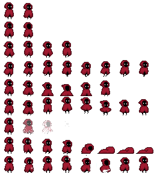
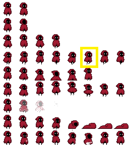

# Cómo trabajar con animaciones de sprites en Jetpack Compose :video_game:

Esta píldora explica paso a paso cómo gestionar y renderizar animaciones basadas en hojas de sprites en Jetpack Compose, utilizando un `ViewModel` para manejar el estado y composables para renderizar las animaciones.

- [Cómo trabajar con animaciones de sprites en Jetpack Compose :video\_game:](#cómo-trabajar-con-animaciones-de-sprites-en-jetpack-compose-video_game)
  - [¿Qué es una hoja de sprites?](#qué-es-una-hoja-de-sprites)
  - [](#)
  - [Arquitectura general del código :gear:](#arquitectura-general-del-código-gear)
  - [Detalle de los componentes](#detalle-de-los-componentes)
      - [**Puntos clave del código**:](#puntos-clave-del-código)
    - [`SpriteAnimationFromSheet`: Renderizado del fotograma](#spriteanimationfromsheet-renderizado-del-fotograma)
    - [`AnimationBox`: Contenedor visual de la animación](#animationbox-contenedor-visual-de-la-animación)
    - [**`CharacterAnimation`: Ejemplo de uso**](#characteranimation-ejemplo-de-uso)
  - [Resumen y mejores prácticas :memo:](#resumen-y-mejores-prácticas-memo)
  - [Contacto](#contacto)

---

## ¿Qué es una hoja de sprites?

Una hoja de sprites (sprite sheet) es una imagen que contiene múltiples fotogramas organizados en filas y columnas. Cada fila representa una animación (por ejemplo, caminar, saltar) y cada columna un fotograma de esa animación.


---

## Arquitectura general del código :gear:

El sistema de animación está compuesto por los siguientes elementos:

1. **`CharacterViewModel`**: Maneja el estado de la animación (nombre de la animación, fotograma actual, etc.).
2. **`SpriteAnimationFromSheet`**: Composable que renderiza un fotograma específico desde la hoja de sprites.
3. **`AnimationBox`**: Layout que contiene la animación y un selector para cambiar entre animaciones.
4. **Funciones específicas**: Ejemplos concretos para manejar personajes (`CharacterAnimation`) y zombis (`ZombiAnimation`).

---

## Detalle de los componentes

**`CharacterViewModel`: Controlador de animaciones**

El `ViewModel` es el corazón de la lógica. Maneja:
- El estado actual de la animación (`_currentAnimation`).
- El fotograma actual (`_currentFrame`).
- El control del bucle de reproducción (`characterLoop`).

#### **Puntos clave del código**:

**Inicialización y ciclo de animaciones:**

```kotlin
init {
    characterLoop() // Inicia el ciclo de reproducción
}

private fun characterLoop() {
    if (_isAnimationComplete.value) {

        // Se establece la animación como no terminadad y se actualiza la animación a reproducir
        _isAnimationComplete.value = false
        _currentAnimation.value = _nextAnimation.value

        job = playAnimation() // Llama a la función que reproduce la animación

        viewModelScope.launch {
            job?.join() // Espera a que termine la animación actual
            _isAnimationComplete.value = true
            characterLoop() // Reinicia el ciclo
        }
    }
}
```

**Cambio de animaciones:**

El método `changeAnimation` permite cambiar dinámicamente entre animaciones.

```kotlin
fun changeAnimation(newAnimation: String) {
    _nextAnimation.value = newAnimation
}
```
*(Inserta un flujo visual mostrando cómo se pasa de una animación a otra, y cómo se actualizan los fotogramas.)*

---

### `SpriteAnimationFromSheet`: Renderizado del fotograma

Este `Composable` extrae el fotograma actual desde la hoja de sprites y lo dibuja en pantalla. Los parámetros clave son:
- `frameWidth` y `frameHeight`: Dimensiones del fotograma.
- `row` y `currentFrame`: Indican qué fotograma extraer.
- 
**Cálculo de las coordenadas del fotograma:**

```kotlin
val srcOffsetX = currentFrame * (frameWidth + gap) + xCorrection
val srcOffsetY = row * (frameHeight + gap) + yCorrection
```

Como se puede ver, a parte multiplicar el tamaño de los frames por las filas y columnas.

**Renderizado en un `Canvas`:**

```kotlin
Canvas(modifier = Modifier.size(canvasX.dp, canvasY.dp)) {
    drawImage(
        image = spriteSheet,
        srcOffset = IntOffset(srcOffsetX, srcOffsetY),
        srcSize = IntSize(frameWidth, frameHeight),
        dstOffset = dstOffset,
        dstSize = IntSize(frameWidth, frameHeight) * scale
    )
}
```

Por ejemplo, para extraer el fotograma 6 de la 4 fila usaríamos los parámetros siguientes:

```kotlin
SpriteAnimationFromSheet(
    spriteSheet = spriteSheet,
    scale = 6,
    frameWidth = 32,
    frameHeight = 32,
    row = 3,
    currentFrame = 6
)
```



Lo que haremos para la animación, será determinar la fila y la columna a renderizar a prtir del view model.

```kotlin
    row = characterController.animationRow(),
    currentFrame = currentFrame
```


---

### `AnimationBox`: Contenedor visual de la animación

Este `Composable` organiza el diseño para mostrar:
1. La animación actual.
2. Un selector con los nombres de las animaciones disponibles.
 
```kotlin
Box(
    modifier = Modifier
        .padding(innerPadding)
        .fillMaxSize(),
    contentAlignment = Alignment.Center
) {
    Row(
        horizontalArrangement = Arrangement.SpaceEvenly,
        verticalAlignment = Alignment.CenterVertically
    ) {
        view.invoke() // Renderiza la animación seleccionada

        Column(
            verticalArrangement = Arrangement.SpaceEvenly,
            modifier = Modifier
                .padding(16.dp)
                .border(1.dp, color = Color.Black)
        ) {
            viewModel.animationNames().map { name ->
                Text(
                    name,
                    modifier = Modifier
                        .padding(horizontal = 3.dp, vertical = 0.dp)
                        .clickable { viewModel.changeAnimation(name) }
                )
            }
        }
    }
}
```

*(Inserta una captura de pantalla del diseño generado, mostrando el selector de animaciones y el área de visualización.)*

---


### **`CharacterAnimation`: Ejemplo de uso**

Este `Composable` utiliza el `ViewModel` para renderizar un personaje animado. Los datos del fotograma actual se extraen directamente desde el estado del `ViewModel`.

**Renderizar un personaje:**

```kotlin
@Composable
fun CharacterAnimation(characterController: CharacterViewModel) {
    val currentFrame by characterController.currentFrame.observeAsState(0)
    val spriteSheet = ImageBitmap.imageResource(R.drawable.char_main)

    Box(modifier = Modifier.size(61.dp, 63.dp)) {
        SpriteAnimationFromSheet(
            spriteSheet = spriteSheet,
            size = 5,
            frameWidth = 32,
            frameHeight = 32,
            row = characterController.animationRow(),
            currentFrame = currentFrame,
            yCorrection = 1
        )
    }
}
```

## Resumen y mejores prácticas :memo:

1. **Organización de la hoja de sprites**: Asegúrate de que los fotogramas tienen dimensiones uniformes.
2. **Control del tiempo**: Ajusta el `delay` en `playAnimation` para animaciones fluidas.
3. **Modularidad**: Mantén el `ViewModel` independiente de la implementación visual para facilitar la reutilización.

## Contacto

Autor: [Mikel Dalmau](https://github.com/mikeldalmauc)  
GitHub: [@mikeldalmauc](https://github.com/mikeldalmauc)

