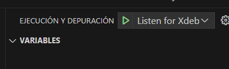
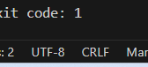

- [Guía paso a paso para configurar un entorno de desarrollo con Docker](#guía-paso-a-paso-para-configurar-un-entorno-de-desarrollo-con-docker)
- [Paso 1: Configurar la base de datos MySQL](#paso-1-configurar-la-base-de-datos-mysql)
- [Paso 2: Agregar el contenedor de Nginx](#paso-2-agregar-el-contenedor-de-nginx)
    - [Configuración de Nginx](#configuración-de-nginx)
    - [Probando la configuración de Nginx](#probando-la-configuración-de-nginx)
- [Instalar entorno de desarrollo Laravel con VUE](#instalar-entorno-de-desarrollo-laravel-con-vue)
- [Referencias](#referencias)


# Guía paso a paso para configurar un entorno de desarrollo con Docker

En este tutorial, vamos a configurar un entorno de desarrollo para una aplicación Laravel utilizando Docker. Vamos a utilizar **MySQL** como base de datos, **Nginx** como servidor web y **phpmyadmin** como cliente de base de datos. 


# Paso 1: Configurar la base de datos MySQL

De cara a desarrollar aplicaciones que utilicen una base de datos, ya sea mysql, redis, mongodb, etc, es necesario tener un servidor de base de datos instalado en tu máquina local. En este caso, vamos a instalar **MySQL**, a la vez que un cliente para poder interactuar con la base de datos.

El cliente que vamos a instalar es phpmyadmin, que es una herramienta de administración de MySQL escrita en PHP. Para instalar MySQL y phpmyadmin, vamos a utilizar docker, creando un contenedor para cada uno de ellos.

Para ello, vamos a crear un fichero **docker-compose.yml** en el directorio raíz de nuestro proyecto.

Además, vamos a realizar una serie de cambios en el fichero **docker-compose.yml** para:
1. crear una red de docker para que los contenedores puedan comunicarse entre sí y aislarlos del resto de contenedores que tengamos en nuestra máquina.
2. Añadir un volumen para persistir los datos de la base de datos, de manera que si eliminamos el contenedor, los datos no se pierdan.
3. Asegurarnos de que el contenedor de phpmyadmin se inicia después de que el contenedor de mysql esté en funcionamiento.

```yaml
services: 
  mysql:
    image: mysql:8.0
    container_name: mysql
    environment:
      MYSQL_ROOT_PASSWORD: root
      MYSQL_DATABASE: laravel
      MYSQL_USER: laravel
      MYSQL_PASSWORD: laravel
    # 
    # Estos parámetros los puedes descomentar si quieres persistir los datos de la base de datos
    # además de mapear el puerto 3306 si necesitas acceder a la base de datos desde un cliente externo
    # como por ejemplo MySQL Workbench
    #
    # volumes:
    #  - mysql-data:/var/lib/mysql
    # ports:
    #  - 3306:3306
    networks:
      - app-network

  phpmyadmin:
    image: phpmyadmin/phpmyadmin
    container_name: phpmyadmin
    environment:
      PMA_HOST: mysql
      MYSQL_ROOT_PASSWORD: root
    ports:
      - 8081:80
    depends_on:
      - mysql
    networks:
      - app-network
      
# volumes:
  # mysql-data:

networks:
  app-network:
```

Una vez que hemos creado el archivo **docker-compose.yml** en la raiz del proyecto, y ubicado un interprete de comandos en esa misma carpeta, vamos a ejecutar el siguiente comando para crear los contenedores de MySQL y phpmyadmin:

```bash
docker-compose up -d
```

Si prefieres utilizar otro cliente, puedes descomentar la línea 5 del archivo docker-compose.yml y comentar la línea 6, para instalar MySQL Workbench en lugar de phpmyadmin.

Si accedemos a la página de phpmyadmin (localhost:8081), veremos que no podemos acceder a la interfaz usando `root`/`root`. 


# Paso 2: Agregar el contenedor de Nginx

Para gestionar la exposición de los servicios web, necesitamos un servidor web que actúe como **proxy inverso** y redirija las peticiones a los contenedores correspondientes.

En este caso, vamos a utilizar **Nginx**. Para ello, vamos a añadir un nuevo servicio en nuestro archivo **docker-compose.yml**.

```yaml	
  nginx:
    image: nginx:latest
    container_name: nginx
    ports:
      - 8080:80
    volumes:
      - ./nginx:/etc/nginx/conf.d
      - .:/var/www/html
    networks:
      - app-network
    # depends_on:
    #  - laravel
```

Si nos fijamos, en el nuevo bloque de configuración de Nginx, hemos añadido dos volúmenes. El primero, mapea la carpeta **nginx** de nuestro proyecto en la carpeta **/etc/nginx/conf.d** del contenedor de Nginx. El segundo, mapea la carpeta raíz de nuestro proyecto en la carpeta **/var/www/html** del contenedor de Nginx. Esto solo lo hacemos en entornos de desarrollo, en producción, no es recomendable mapear la carpeta raíz de nuestro proyecto en el contenedor de Nginx.

### Configuración de Nginx

Ahora, vamos a crear un archivo de configuración para Nginx en la carpeta **nginx** que hemos mapeado en el contenedor. En este archivo, vamos a configurar Nginx para que redirija las peticiones.

El archivo de configuración de Nginx debe tener el siguiente contenido. Por ahora, vamos a dejarlo así. A medida que avancemos en el desarrollo, iremos añadiendo más configuraciones y explicando su funcionamiento.

```nginx 
server {
    listen 80;
    server_name example.com;

    root /var/www/html/public;

    index index.php index.html;

    # Redirige todo al archivo index.php si no es un archivo estático
    location / {
        try_files $uri $uri/ /index.php?$query_string;
    }

    # Denegar acceso a archivos sensibles
    location ~ /\.ht {
        deny all;
    }
}
```

**Bloque del servidor (`server`)**

```nginx
server {
    listen 80;
    server_name localhost;
```

- `listen 80`: Configura Nginx para escuchar en el puerto 80 (puerto HTTP estándar).
- `server_name localhost`: Indica que este bloque de configuración se aplica a solicitudes que tengan como destino `localhost`. En producción, reemplazarías esto con tu dominio (por ejemplo, `example.com`).

**Configuración de la raíz del servidor**

```nginx
root /var/www/html/public;
```

- `root`: Define el directorio raíz del sitio web. En este caso, apunta al directorio `public` de un proyecto Laravel, ya que Laravel expone sus archivos públicos en esta carpeta.

**Configuración de índice predeterminado**

```nginx
index index.php index.html;
```

- `index`: Define los archivos que se buscarán automáticamente cuando un usuario accede a la raíz o a un directorio. Aquí, se buscará primero `index.php` y luego `index.html`.


**Bloque `location /`**

```nginx
location / {
    try_files $uri $uri/ /index.php?$query_string;
}
```

- `location /`: Se aplica a todas las solicitudes que coincidan con la raíz (`/`).
- `try_files $uri $uri/ /index.php?$query_string`:
  - Intenta servir:
    1. El archivo exacto solicitado (`$uri`).
    2. Un directorio con el nombre solicitado (`$uri/`).
    3. Si ninguna de las dos opciones anteriores existe, reenvía la solicitud a `index.php`, pasando los parámetros de la consulta (`$query_string`).
  - Esto es esencial para Laravel, ya que todas las solicitudes que no coincidan con un archivo existente deben ser manejadas por `index.php`.

**Bloque `location ~ /\.ht`**

```nginx
location ~ /\.ht {
    deny all;
}
```

- `location ~ /\.ht`: Se aplica a cualquier archivo que comience con `.ht` (como `.htaccess`, `.htpasswd`).
- `deny all`: Deniega el acceso a estos archivos. Esto es importante para proteger archivos de configuración que podrían contener información sensible.

### Probando la configuración de Nginx

Una vez que hemos creado el archivo de configuración de Nginx, vamos a arrancar el proyecto con el comando `docker-compose up -d` y acceder a la dirección [nginx](localhost:8080) en nuestro navegador.

```bash
docker-compose up -d
```

Si te ha dado un error interno al acceder al servicio, es completamente normal ya que si recordais la configuración, hemos cambiado la ruta en la que ngnix sirve archivos index.php o index.html `root /var/www/html/public;`

Por lo tanto, vamos a crear una página web simple de bienvenida y guardarla en la carpeta public. Nuestro entorno de desarroll debería verse así, *(sin la carpeta spetbystep)*


**index.html**
```html
<!DOCTYPE html>
<html lang="es">
<head>
    <meta charset="UTF-8">
    <meta name="viewport" content="width=device-width, initial-scale=1.0">
    <title>Mi Página</title>
    <script src="https://unpkg.com/@dotlottie/player-component@2.7.12/dist/dotlottie-player.mjs" type="module"></script>
    <style>
        body {
            font-family: 'Roboto', sans-serif;
            margin: 0;
            padding: 0;
            display: flex;
            justify-content: center;
            align-items: center;
            height: 100vh;
            background: white;
            color: #333;
            overflow: hidden;
        }

        #container {
            text-align: center;
        }

        h1 {
            font-size: 5rem;
            margin-bottom: 30px;
        }

        #circle {
            width: 350px;
            height: 350px;
            background-color: rgba(200, 200, 200, 0.5);
            border-radius: 50%;
            position: relative;
            margin: 0 auto;
            box-shadow: 0px 20px 50px rgba(0, 0, 0, 0.1);
        }

        dotlottie-player {
            width: 350px;
            height: 350px;
            position: absolute;
            top: 0;
            left: 0;
        }
    </style>
</head>

<body>
    <div id="container">
        <h1>Server is up!</h1>
        <div id="circle">
            <dotlottie-player src="https://lottie.host/6d863761-b82b-4491-bb57-145b2c0c5870/VbwprXqzhc.lottie"
                background="transparent" speed="1" loop autoplay></dotlottie-player>
        </div>
    </div>
</body>https://laravel.com/docs/11.x/starter-kits#breeze-and-inertia

</html>
```

Ahora sí, deberíamos ser capaces de ver la página de bienvenida que hemos creado.


# Instalar entorno de desarrollo Laravel con VUE

Instalar laravel junto con tecnologías modernas puede ser complejo y trabajoso a la hora de configura el entorno de desarrollo y gestionar las versiones de los distintos entornos. Para esto, laravel ofrece algunas soluciones para integrar nuestros front end en el framework, [una de ellas es inertiajs Breeze and inertia](https://laravel.com/docs/11.x/starter-kits#breeze-and-inertia) . 

Concretamente, descargar y copiar el contenido de este repositorio[Demo application](https://inertiajs.com/demo-application) en la raiz de nuestro proyecto, pero sin incluir el directorio oculto de nombre `.git`.

Ahora la estructura de nuestro proyecto debería verse así más o menos:



# Referencias 
https://es.vite.dev/guide/

https://laravel.com/docs/11.x/frontend