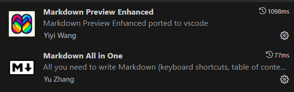

# Cómo crear una nueva píldora :pill:

- [Cómo crear una nueva píldora :pill:](#cómo-crear-una-nueva-píldora-pill)
  - [¿Qué es una píldora?](#qué-es-una-píldora)
  - [Herramientas recomendadas :wrench:](#herramientas-recomendadas-wrench)
    - [Extensiones para Visual](#extensiones-para-visual)
  - [Pasos para redactar una píldora :paw\_prints:](#pasos-para-redactar-una-píldora-paw_prints)
  - [Guía de estilo :memo:](#guía-de-estilo-memo)
  - [Referencias útiles](#referencias-útiles)
  - [Contacto](#contacto)

## ¿Qué es una píldora?

Una píldora es un documento breve y concreto que explica o resuelve un tema específico, redactado en formato Markdown para facilitar su integración en este repositorio alojado en GitHub.

## Herramientas recomendadas :wrench:

Para redactar una píldora de forma sencilla, recomiendo encarecidamente el uso de las siguientes herramientas:

- **[Visual Studio Code](https://code.visualstudio.com/)**: Editor de código versátil y fácil de usar.
- **[Git](https://git-scm.com/)**: Para clonar y hacer una pull request tras crear la píldora.

### Extensiones para Visual 

- **[Markdown All in One](https://marketplace.visualstudio.com/items?itemName=yzhang.markdown-all-in-one)**: Extensión para Visual Studio Code que ayuda con la edición de Markdown.
- **[Markdown preview enhanced](https://marketplace.visualstudio.com/items?itemName=shd101wyy.markdown-preview-enhanced)**: Extensión para Visual Studio Code que permite previsualizar el archivo mientras lo editas.
---
## Pasos para redactar una píldora :paw_prints:

1. **Haz un fork** del [repositorio de las píldoras](https://github.com/FPTxurdinagaDAM/pildoras). Si no sabes cómo, consulta esta guía: [Cómo hacer un fork](https://www.freecodecamp.org/espanol/news/como-hacer-tu-primer-pull-request-en-github/).
2. **Crea una nueva carpeta** para tu píldora en una ubicación apropiada del proyecto.
3. **Redacta tu contenido** en un archivo Markdown dentro de esa carpeta.
   - Usa un nombre descriptivo para el archivo (por ejemplo, `como-instalar-git.md`).
4. **Enlaza tu píldora** en el archivo principal del repositorio ([README.md](../README.md)) para que otros puedan encontrarla fácilmente.
5. **Firma tu píldora** añadiendo tu contacto de GitHub en un apartado al final del documento, para que otros puedan contactarte si tienen dudas o sugerencias.
6. **Haz una pull request** para integrar tu píldora al repositorio. Consulta esta guía si tienes dudas: [Cómo hacer un pull request](https://www.freecodecamp.org/espanol/news/como-hacer-tu-primer-pull-request-en-github/).
7. :tada: **Felicidades!** Has creado tu primera píldora, tus companeros agradecerán tu colaboración.
  

*Una vez enviada, los administradores revisarán tu pull request.*
- *Si está bien hecha, la aprobaremos e integraremos en el repositorio.*
- *Si necesita correcciones, te indicaremos cómo mejorarla.*

## Guía de estilo :memo:

- **Usa enlaces**: Vincula recursos útiles (webs, otras píldoras o documentos) en lugar de solo mencionarlos.
- **Incluye emojis**: Hacen el contenido más visual e interesante (consulta la referencia de emojis al final).
- **Aprovecha Markdown**: Utiliza listas, tablas, índices y cualquier funcionalidad que enriquezca tu documento. Utiliza este documento como referencia.
- **Sé claro y conciso**: Evita explicaciones demasiado largas o complejas.
- **Usa imágenes**: Si es posible, agrega imágenes o capturas para ilustrar mejor el contenido.

## Referencias útiles

- [Emojis soportados por GitHub :octocat:](https://gist.github.com/rxaviers/7360908)
- [Cómo hacer un pull request](https://www.freecodecamp.org/espanol/news/como-hacer-tu-primer-pull-request-en-github/)
- [Guía básica de Markdown](https://markdown.es/)

---

Si necesitas inspiración o quieres saber más sobre mi trabajo, visita mi perfil de GitHub [@mikeldalmauc](https://github.com/mikeldalmauc) :sparkles:

## Contacto

Autor: [Mikel Dalmau](http://www.mikeldalmau.com)  
GitHub: [@mikeldalmauc](https://github.com/mikeldalmauc)

